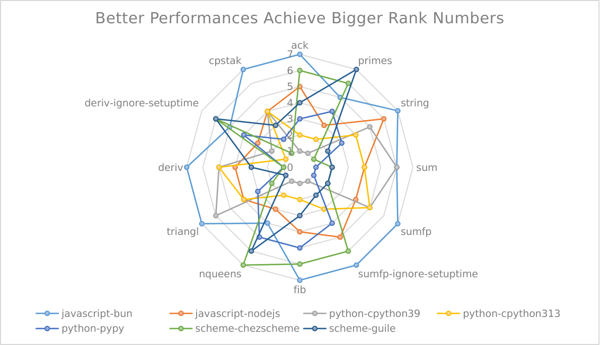

# Various Programming Language Benchmark

I want to know exactly how different programming languages perform. However, nowadays, there aren't many open projects on the Internet for this purpose.

This repository currently supports comparisons between Scheme and JavaScript.

## How to run benchmarks on your own computer
### Prerequisites
* [Nix](https://nixos.org/) is a tool that takes a unique approach to package management and system configuration. I use it to create a reproducible environment for running benchmarks. You may need to install it on your system.
* [flake](https://nixos.wiki/wiki/flakes) provides a standard way to write Nix expressions (and therefore packages) whose dependencies are version-pinned in a lock file, improving reproducibility of Nix installations. We use it to manage environments and run benchmarks
* The `time` command. The Bash-default `time` command is a shell keyword. This project requires the real `time` command, which some Linux distributions don't install by default. On my NixOS laptop, I install the `time` command with:
```nix
environment.systemPackages = [
  pkgs.time
];
```

### Run & get results

```bash
bash run.sh
```
All results are in the [`./output`](./output) directory.
> Note that `run.sh` does not really test all languages, due to that quickjs will failed on serveral benchmarks. To test all languages, you can run `nix-bench all` instead.

To run benchmarks for a specific implementation, please use
```bash
bash nix-bench "<lang>/<impl>"
```

The result will be in `./output/once-time/` directory.  All available implementations are listed with `bash nix-bench --list`.

If you don't want to use Nix, you can use `bench` instead. That will try to call the existed binary executable on your system.

## Which Languages and Environments
1. javascript/nodejs
2. javascript/bun: I don't know why [Bun](./language-environments/javascript/bun/) achieves such fast results. Google suggests that it uses some unsafe behaviors, so by default, I won't rank it as the winner in the following table. But if you want Bun's performance, you can refer to [here](./output/javascript-bun).
3. javascript/quickjs: Thanks to [Flamme Shadow](https://github.com/FlammeShadow), he contributes this environment to this repository. Though he mentioned in this [pr](https://github.com/ufo5260987423/various-program-languages-benchmark/pull/3) that many benchmarks couldn't work, personally, I think his experience makes a baseline: if any languages cannot reach it, applying them in actual practice should be considerated more than two times.
4. scheme/chezscheme
5. scheme/guile
6. python/pypy
7. python/cpython3.13 & python/cpython3.9: Python has significant performance improvements since 3.10, so two different versions are chosen to compare performance.

## Benchmark List
All benchmarks are listed in the [src directory](./src). I tried my best to ensure that different languages consistently perform similar operations on the same tasks. All benchmarks are migrated from [here](https://github.com/ecraven/r7rs-benchmarks), and I'll gradually add others.

| Benchmark | Description | NOTE |
| --- | --- | --- | 
| [ack](./src/ack) | A recursive function with more than one parameter, it seems to evaluate Scheme's tail-call optimization. | For many languages like JavaScript, tail-call optimization is usually not implemented. To do a detailed comparison, I call the `ack` function as `ack(3,10)`, which is too small to showcase Scheme's advantage. | 
| [primes](./src/primes) | A recursive function to calculate prime numbers. | For many languages like JavaScript, tail-call optimization is usually not implemented. | 
| [string](./src/string) | String operations mainly on concatenation and splitting. | Different languages often have specific details in string handling, leading to significant performance differences for similar operations. | 
| [sum](./src/sum) | Sum up integers from 1 to n using recursion. |  | 
| [sumfp](./src/sumfp) | Sum up the float representation of integers from 1.0 to n using recursion. |  | 
| [sumfp-ignore-setuptime](./src/sumfp) | Performs the sum operation many times to ignore setup time. | Chez Scheme outperforms NodeJS, but clearly doesn't compete with Bun. Now, my question is: how does Bun do it? |
| [fib](./src/fib) | Fibonacci calculation. |  | 
| [nqueens](./src/nqueens) | N-queen problem. |  | 
| [triangl](./src/triangl) | I'm not sure what this does. |  | 
| [deriv](./src/deriv) | List derivation for symbolic computation. |  | 
| [deriv-ignore-setuptime](./src/deriv) | Performs list derivation many times to ignore setup time. |  | 
| [cpstak](./src/cpstak) | CPS (continuation-passing style) computation. |  | 

## What I learned from these benchmarks

1. Chez Scheme seems to perform well with recursion. Techniques like tail-call optimization really work.
2. In my view, for those benchmarks that take less than 0.06 seconds in Chez Scheme, setup time really matters.


>NOTE: Big number means high rank.